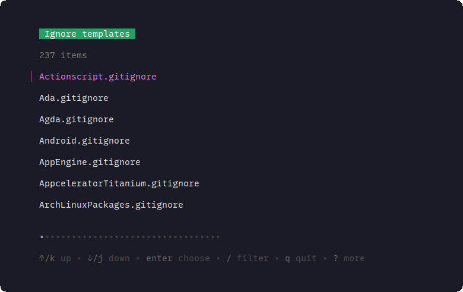
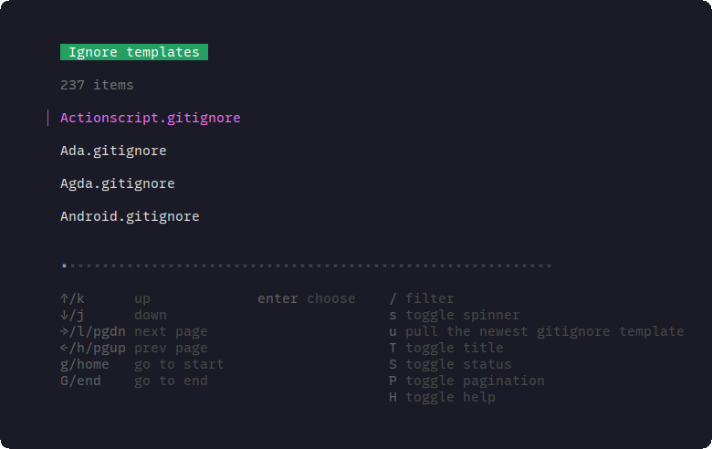
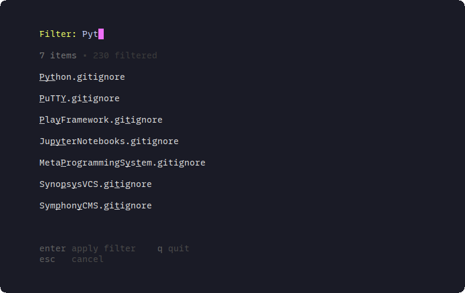
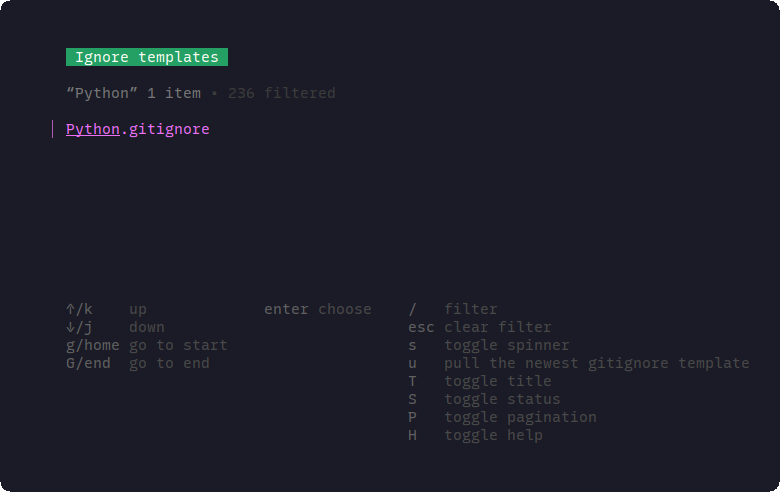
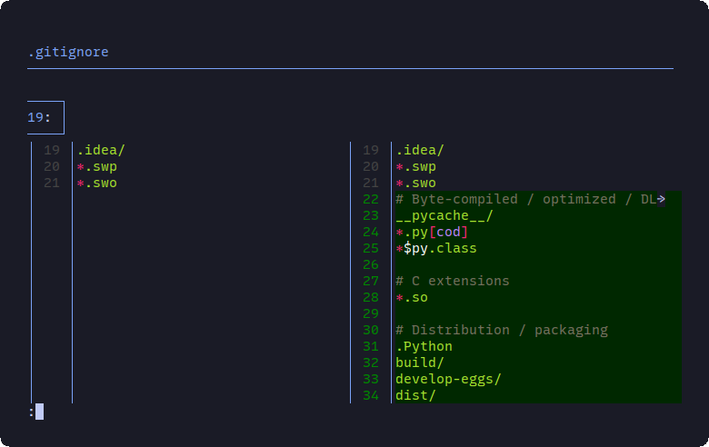

# GoIgnore

- [GoIgnore](#goignore)
  - [1. Features](#1-features)
  - [2. Install](#2-install)
  - [3. Usage](#3-usage)

A `.gitignore` wizard which gnerates `.gitignore` files from the command line for you. Inspired by [joe](https://github.com/karan/joe)

## 1. Features

- No installation necessary - just use the binary.
- Works on Linux.
- Interactive user interface with [bubbletea](https://github.com/charmbracelet/bubbletea): Pagination, Filtering, Help...
- Supports all Github-supported [.gitignore files](https://github.com/github/gitignore.git).

## 2. Install

- This tool is tested in Linux environment (Ubuntu 20.04).
- Download the latest binary from the [Release page](https://github.com/ntk148v/goignore/releases). It's the easiest way to get started with `goignore`.
- Make sure to add the location of the binary to your `$PATH`.

## 3. Usage

- Just run.

```bash
chmod a+x goignore
goignore
```

- At the first time, `goignore` will download the Gitignore templates from Github. It may take a few seconds (depend on your network).

- The list of gitignore templates.



- Show help.



- Filter.





- Result, the current gitignore is updated.


